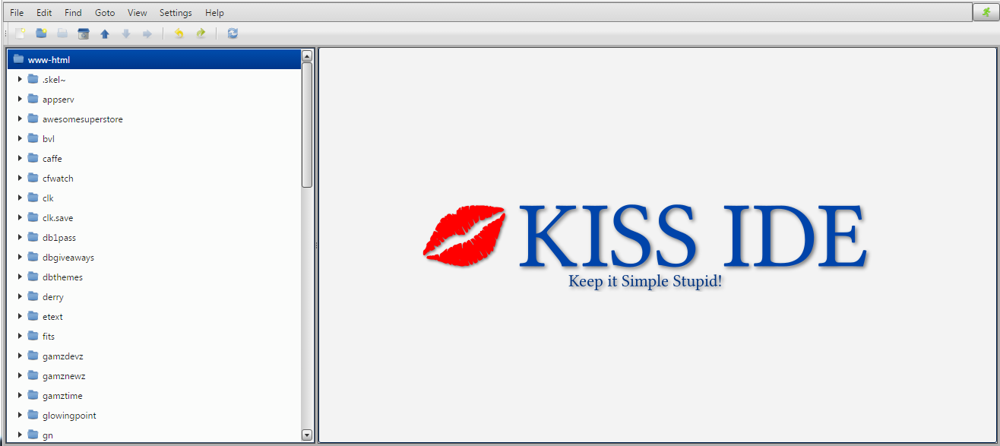
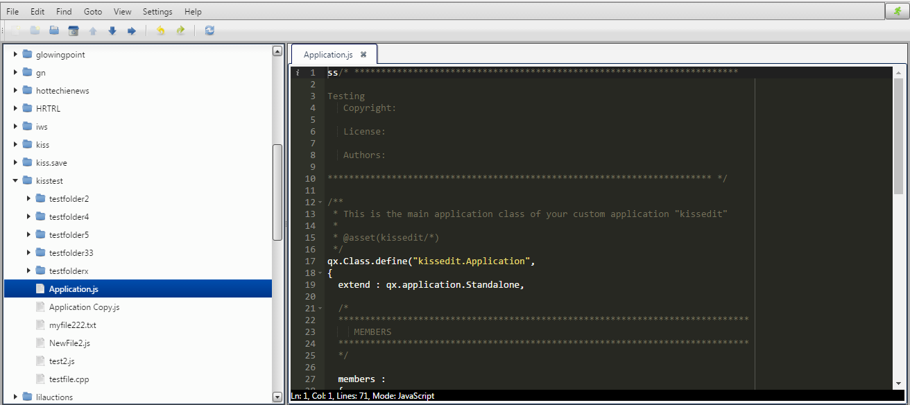

# About

KISS IDE is a simple web based "Integrated Development Environment".  "IDE" is in quotes because initially, at least, it is mostly a simple
filesystem tree with a text editor (although, a pretty good editor named ACE from Cloud9).  More things are planned for the future, but it is 
very usable as is to edit text files on the server on which it is installed.  This makes it very convienent to create/edit Wordpress themes and plugins
or develop custom PHP, Python (maybe Django), Ruby (Rails), Node.js, etc. websites.

Current Version: 0.1

# License

KISS IDE source code is open source and licensed under the GPL Version 3.  Qooxdoo and ACE have their own licenses which are compatible.

# Features

* SPA (Single Page App) with familiar GUI style application interface (utilizing the [qooxdoo](http://qooxdoo.org) Javascript framework)
* Powerful text editor ([ACE](https://ace.c9.io) from Cloud9) with syntax highlighting and error detection for many languages and file types
* Tree style filesystem access
* Supports tab based interface to allow editing multiple files in multiple tabs
* Simple user account system for multiple users
* Two levels of authentication: HTTP basic authentication at the web server level and user accounts at the application level (HTTPS is highly recommended)
* Safe write to "temp file before overwrite" file save operation 
* Confirmation to overwrite file with newer modification date/time
* Configurable text editor theme (both dark and light themes)

# Screen Shots

# Change Log

None yet.

# Road Map

*In no particular order:*

* Implement drag-and-drop in the filesystem tree
* Implement copy/paste in the filesystem tree
* Implement file execution on server
* Add more customization for the ACE text editor

# Installation Requirements

* Apache
* PHP 5.4 (PHP 7 has not been tested)
* SQLITE3
* PHP SQLITE module

Although the current installation is setup for Apache, it should be straight forward to set it up with Nginx.  It is designed to be a simple alias like
phpmyadmin.

# Installation

Currently installation is accomplished by a self-extracting shell script ([kissideinst.sh](kissideinst.sh)) that will install into /usr/share/kisside and
setup the Apache config file in /etc/apache2/config-available and /etc/apache2/config-enabled and prompt for the Basic Authentication username/password and 
for the initial admin username/password.  Note that the installation script can be run multiple times and will only update on subsequent runs.  This installation
has only been tested on Ubuntu 14.04 with required packages installed.

The goal is to eventually provide Debian and Redhat packages with required dependencies (and hopefully get the packages into official repositories).

# Build Requirements

* qooxdoo SDK 5.0.1 (currently requires patched version available [here](qooxdoo-5.0.1-sdk.tgz), although it might work with master branch from github [here](https://github.com/qooxdoo/qooxdoo))

The qooxdoo SDK must be installed one directory below KISS IDE in the folder qooxdoo-5.0.1-sdk or you must modify the generate.py script with the folder where the SDK can be found.

# Configuration

The configuration is stored in the PHP file /usr/share/kisside/www/api/config.php.

The folders available in KISS IDE are controlled by the $BASE_DIRS array.  Each entry defines one folder and entries are separated by commas using standard PHP syntax for arrays.  By default, 
$BASE_DIRS has only one entry:

"www-html" => "/var/www/html"

that specifies a folder named "www-html" that is located at "/var/www/html" in the server filesystem.  This allows access to all folders under /var/www/html which is the standard html folder for Apache.  

If you modify this array, you will also need to modify the PHP open_basedir setting in /etc/apache2/conf-available/kisside.conf file to include the specified directory or directories or you will get errors
trying to access the directory.

